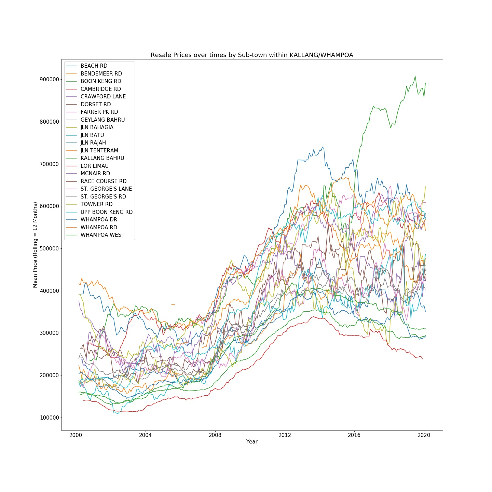
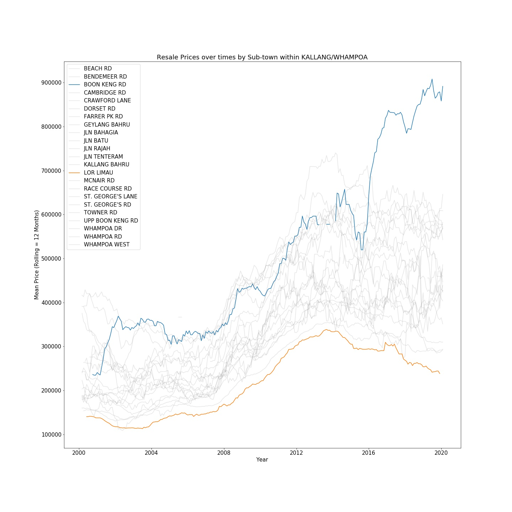

### Resale Price Analysis: Intra-Town Relative Valuation over Time
<b>Author:</b> Ian Ho

<b>Purpose</b>
To understand intra-town distribution of resale prices over time 

<b>Potential Application</b>
Identify outlier sub-towns which suffer from depressed resale prices 

<b>Glimpse of Preliminary Work</b> 
Can Specify Rolling Period parameter

<b>Additional Feature:</b>Can Highlight specific areas for easy comparison

